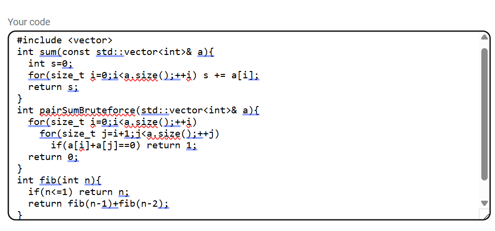
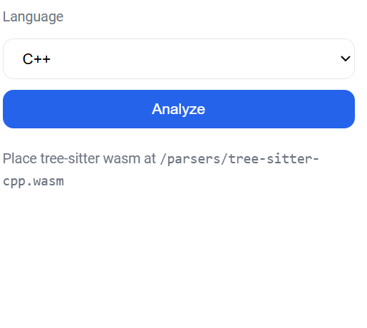
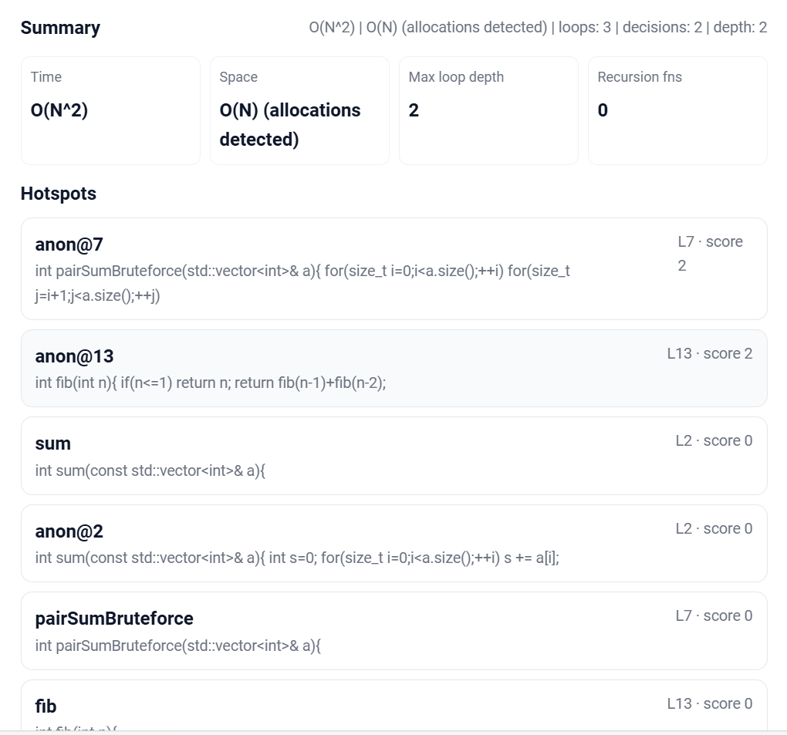

# 🧮 Complexity Analyzer

[](LICENSE)


A **web-based complexity analysis tool** built with **React + Vite** and powered by **Tree-sitter parsers (C++, Java, Python)**.  
Paste your code, select the language, and instantly analyze its complexity!

---

## ✨ Features
- 📂 **Multi-language support**: C++, Java, Python  
- ⚡ **Real-time parsing** using WebAssembly + Tree-sitter  
- 🎨 **Modern UI** built with React & Vite  
- 🛠️ **Brute-force complexity detection** for sample algorithms  
- 🌐 Works directly in the browser (no server needed!)

---

## 📦 Tech Stack
- [React](https://react.dev/) + [Vite](https://vitejs.dev/)  
- [Tree-sitter](https://tree-sitter.github.io/tree-sitter/) (with WASM parsers)  
- JavaScript (ES Modules)  
- CSS3 for styling  

---

## 🚀 Getting Started

### 1️⃣ Clone the repo
```bash
git clone https://github.com/your-username/complexity-analyzer.git
cd complexity-analyzer
```

### 2️⃣ Install dependencies
```bash
npm install
```

### 3️⃣ Run in development
```bash
npm run dev
```

### 4️⃣ Build for production
```bash
npm run build
npm run preview
```

---

## 📂 Project Structure
```
├── public/
│   ├── parsers/
│   │   ├── tree-sitter.wasm
│   │   ├── tree-sitter-cpp.wasm
│   │   ├── tree-sitter-java.wasm
│   │   └── tree-sitter-python.wasm
│   └── demo/
│
├── src/
│   ├── App.jsx
│   ├── main.jsx
│   └── style.css
│
├── index.html
├── vite.config.mjs
├── package.json
└── README.md
```

---

## 🖼️ Screenshots




| Paste Code | Analyze | Result |
|------------|---------|--------|
|  |  |  |

*(Add your screenshots inside `docs/screenshots/` folder)*

---

## ⚡ How It Works
1. Loads the **Tree-sitter runtime (`tree-sitter.wasm`)**.  
2. Dynamically loads the selected **language grammar** (`tree-sitter-cpp.wasm`, etc.).  
3. Parses the input code and performs **complexity checks**.  
4. Displays results instantly in the browser.  

---

## 🛠️ Known Issues
- Parsers must be placed in `public/parsers/` (Vite copies them during build).  
- Only supports basic brute-force complexity detection for now.  

---

## 🤝 Contributing
Pull requests are welcome!  
If you’d like to add more languages or improve the UI, feel free to fork and submit changes.

---

## 📜 License
This project is licensed under the **MIT License** – see the [LICENSE](LICENSE) file for details.  
